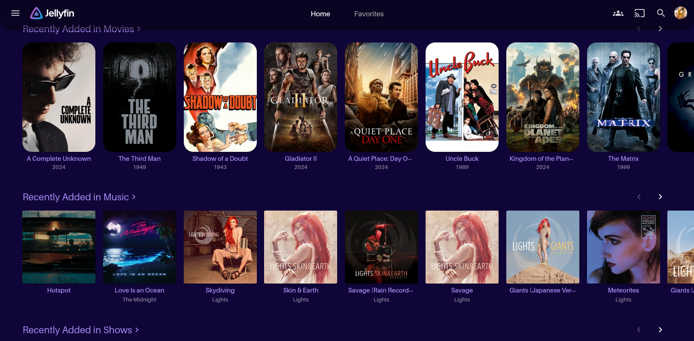

### Jellynautical

A cosmic CSS theme for Jellyfin inspired by my *Cosmonautical* color palatte

### Installation
Update your Jellyfin server's `Custom CSS Code` with the following:
```
@import url("https://cdn.jsdelivr.net/gh/anultravioletaurora/Jellynautical@refs/heads/main/min/cosmonautical.min.css");
```


### Screenshots


